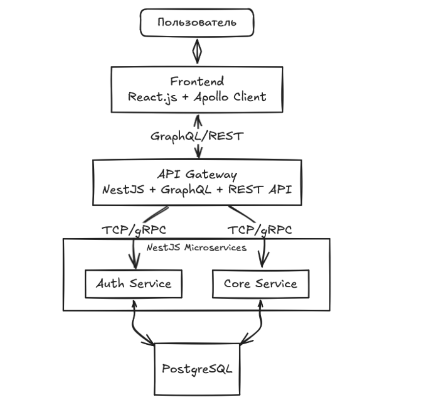
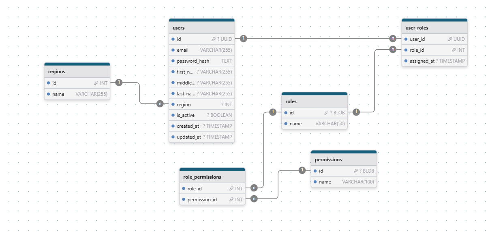
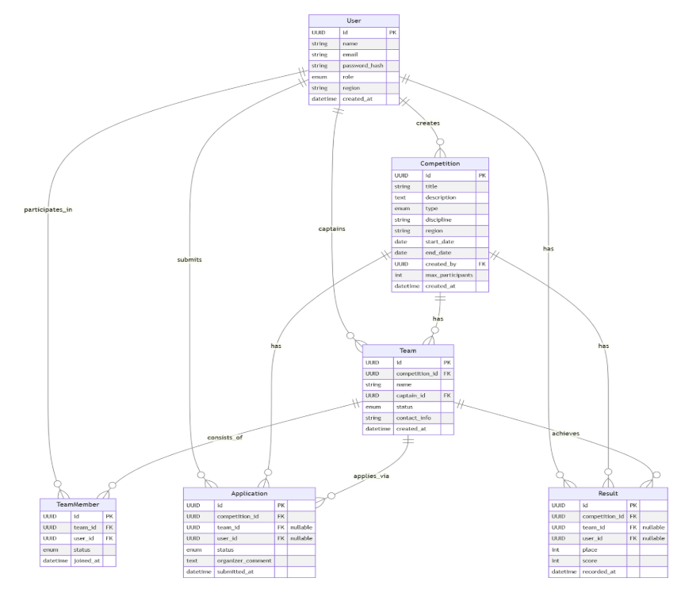

# FSP Cup 2025 - FSP-INFO Platform

**Микросервисная backend‑платформа для автоматизации спортивных соревнований.**

Технологии:  **NestJS**,  **React + NextJS, PostgreSQL**,  **Docker**,  **Yarn Workspaces**.

---

## 🏆 Описание проекта

Всероссийская Федерация спортивного программирования сталкивается с проблемой ручного управления соревнованиями. Эта платформа автоматизирует процесс публикации, модерации и учёта результатов соревнований, объединяя ФСП, региональных представителей и спортсменов.

* **Роли** : ФСП, региональные представители, спортсмены
* **Ключевые сценарии** : регистрация/вход, создание соревнований, формирование/модерация команд, заявки, публикация результатов, личный кабинет, автоматизация рутинных задач

Подробное ТЗ и пользовательские сценарии см. в документации к хакатону и ниже.

---

## 🔗 Ссылки

* Документация к REST API - https://api.fsp-cup.izvenyaisya.ru/docs
* Сервис на хостинге -

---

## 🖥️ Для быстрой проверки и демонстрации

* Готовые тестовые аккаунты:
  * **Админ** : [admin@demo.ru]() / password
  * **Регион** : [region@demo.ru]() / password
  * **Спортсмен** : [sport@demo.ru]() / password

---

## 🚀 Запуск проекта локально

1. git clone `<project>`
2. cd /backend
3. Создай файл `.env` на основе `.env.example`:
4. в корневой директории проекта docker-compose -f docker-compose.dev.yml up --build
5. cd ..
6. cd /frontend
7. yarn dev

* Все микросервисы (`users-service`, `core-service`, `api-gateway`) стартуют в режиме **hot reload** (`nest start <project> --watch`).
* Изменения в коде в папках `apps/*/src` автоматически подхватываются и перезапускают сервис.

---

## 👌 Соответствие требованиям к проектированию

В проекте реализованы и документированы все ключевые элементы архитектуры и структуры данных, предусмотренные требованиями:

* **Архитектура системы:**
  * Подготовлены подробные UML‑диаграммы (Component и Deployment), отражающие все основные компоненты и их взаимодействие.
  * В репозитории размещена DFD-диаграмма, показывающая потоки данных между сервисами (api-gateway, users-service, core-service, база данных).
  * Для каждого микросервиса описано назначение, функции и способы коммуникации (REST API, RPC/TCP между сервисами).
* **Функциональная схема базы данных:**
  * Сформирована ER‑диаграмма с описанием всех сущностей, атрибутов и связей (Users, Teams, Competitions, Applications, Results и др.).
  * Описаны ключевые таблицы, индексы, уникальные и внешние ограничения, а также правила целостности данных.
  * Подробно пояснены принципы хранения, валидации, обработки, а также сценарии масштабирования и резервного копирования.
* **Модульность и расширяемость:**
  * Архитектура построена на принципах изоляции сервисов (микросервисы), что обеспечивает легкость масштабирования и внедрения новых функций без затрагивания существующего кода.
  * Каждый сервис может развертываться и обновляться независимо, поддерживается работа в монорепозитории.
* **Документация и визуализация:**
  * Все архитектурные схемы, диаграммы и пояснения доступны в директории `/docs` репозитория.
  * Документация регулярно обновляется при внесении изменений в архитектуру или структуру данных.

---

## 🧩 Краткая структура проекта

---

## 🧱 Технологический стек

### Backend

* **NestJS** — каркас для модульных серверных приложений и микросервисов на TypeScript/Node.js
* **PostgreSQL** — реляционная СУБД
* **TypeORM** — ORM для работы с PostgreSQL
* **JWT** — авторизация и управление сессиями пользователей
* **Docker** и **Docker Compose** — контейнеризация, orchestration сервисов
* **Yarn Workspaces** — монорепозиторий для микросервисов
* **REST API** и **NestJS Microservices (TCP/RPC)** — связь между сервисами
* **Swagger** — автогенерация документации API
* **Jest** — модульные и интеграционные тесты

### Frontend

* **Next.js** — фреймворк для React с поддержкой SSR/SPA
* **React** — создание UI-компонентов
* **TypeScript** — типизация для фронта и бэка
* **Tailwind CSS** — utility-first CSS для адаптивного дизайна
* **Docker** — контейнеризация фронта

---

## 📝 Сценарии использования и пользовательские роли

* Регистрация пользователей с разными ролями (ФСП, регион, спортсмен)
* CRUD соревнований и управление командами
* Модерация заявок (ручная и автоматическая логика)
* Присоединение к командам, подтверждение участия, публикация и автоматическое добавление результатов в профиль спортсмена
* Адаптивный интерфейс, mobile-first, фильтрация соревнований, поиск
* Автоматизация рутины (автоотклонение заявок «не из региона», автозаполнение профиля, быстрые действия)
* Личный кабинет: заявки, статусы, история достижений

---

## 📸 Скриншоты

* Главная / Лента соревнований
* Личный кабинет спортсмена
* Страница соревнования и команды
* Модерация заявок
* Публикация результатов

---

## 👥 Контакты

* Telegram-чат поддержки: [ссылка]
* Команда: [список участников, Telegram]
